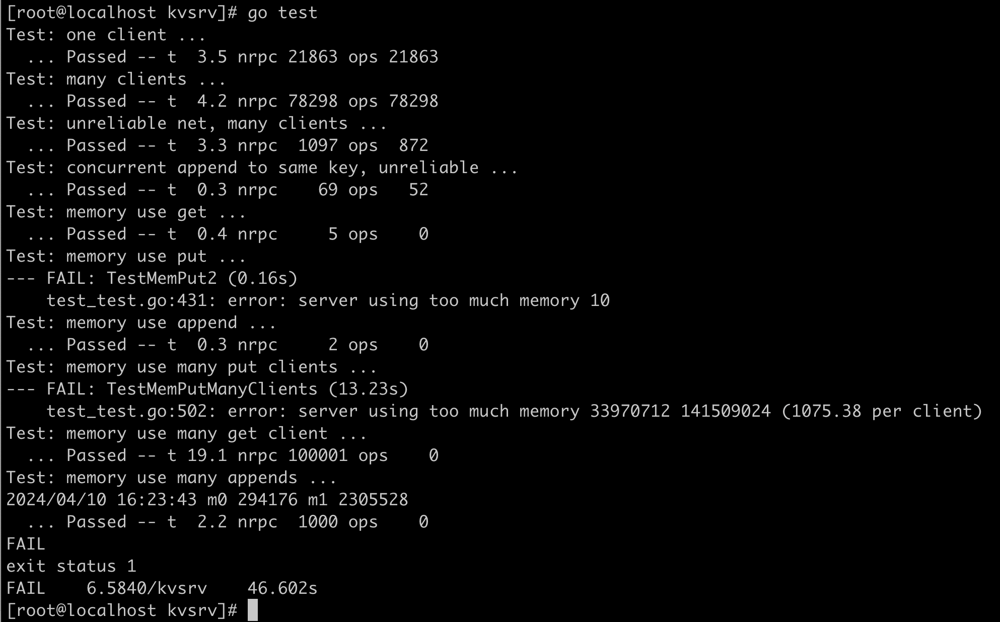
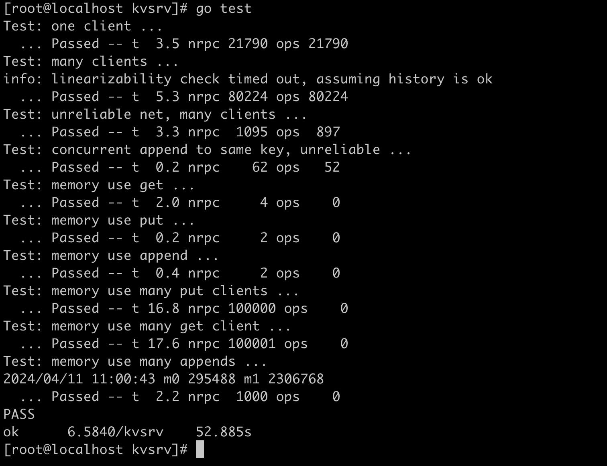

# 1. 开发要点描述
* `Get`
`GET`请求没有什么好说的，直接返回key对应的最新的值即可
* `Put`
`PUT`请求无需返回值
* `Append`
注意`Append`请求要返回当前值，再进行`append`操作，更新成最新值，这里很容易出错

# 2. 使用RPC进行通信
Lab 2里已经封装好了RPC的功能，代码的注释也比较详细，服务端需要先行实现相应的接口，如
```go
func (kv *KVServer) Put(args *PutAppendArgs, reply *PutAppendReply) {
	// Your code here.
	kv.mu.Lock()
	defer kv.mu.Unlock()

	value, ok := kv.history[args.Identifier]
	if ok {
		if value.LastSeq >= args.Seq {
			// do nothing
			return
		}
	}

	kv.db[args.Key] = args.Value
}
```

客户端需要这样调用
```go
ok := ck.server.Call("KVServer.Get", &args, &reply)
```

# 3. 请求去重
考虑到可能有多个`Clerk`，所以需要一个字段来区分多个`Clerk`，同时还需要一个字段`seq`来区分客户端的请求，便于去重。
如果同一个`Clerk`的`seq`相同，就表明这个请求是重复发送的`RPC`请求，并非是新的请求。
区分是否为新的Put和Append请求对保持线性化至关重要，不能重复执行同一个`Put`和`Append`请求。
```go
type Clerk struct {
	server *labrpc.ClientEnd
	// You will have to modify this struct.
	seq        uint64
	identifier int64 // identify Clerk
}
```
其中`seq`从0自增，每个`Clerk`的`identifier`都不一样。

服务端为了处理`Append`请求，需要构建一个`map`，记录历史数据，这样可以在收到相同`seq`的`Append`请求时，直接返回历史值。
之所以要返回历史值，是因为对于重复的`Append`请求来说，当前的值是最新值了。

对于`Put`请求来说，保存历史值并无必要，因为`Put`请求无需有返回值。

# 4. GET请求不去重不影响线性化
所以对于服务端`GET`的实现，就很直接明了，无需去重。

# 5. 内存占用过大
起初我未能通过第6个和第8个测试用例，分别是：
* Test: memory use put ...
* memory use many put clients ...

其原因时，我在处理`Put`去重时也保存了一份数据(即`value`)到历史表中，极大地消耗了内存空间。后面把历史表的填充去除之后，顺利通过了所有的测试。

# 6. 结果
循环100次`go test`都没有出现错误。