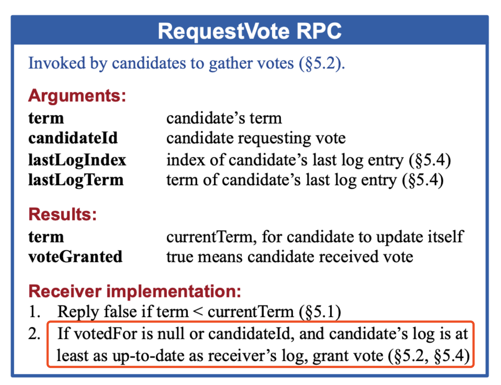

# 1. 开发要点描述
* 实现Raft协议的leader election
* 实现投票操作，包括收集选票（Raft.RequestVote）
* Leader向follower发送心跳（Raft.AppendEntries）

# 2. Raft协议之leader election
这幅图是重中之重，需要仔细研读


# 3. Raft结构体
参考上图中的`State`部分，再添加其他几个重要的成员变量，比如本节点的角色`role`、上次收到请求的时间戳`lastRenewTime`、当前节点在选举时收到的票数`votedCount`等。
```go
// A Go object implementing a single Raft peer.
type Raft struct {
	mu        sync.Mutex          // Lock to protect shared access to this peer's state
	peers     []*labrpc.ClientEnd // RPC end points of all peers
	persister *Persister          // Object to hold this peer's persisted state
	me        int                 // this peer's index into peers[]
	dead      int32               // set by Kill()

	// Your data here (3A, 3B, 3C).
	// Look at the paper's Figure 2 for a description of what
	// state a Raft server must maintain.
	currentTerm int
	votedFor    int // who I vote?
	log         []*LogEntry

	// volatile state on all servers
	commitIndex int
	lastApplied int

	// volatile state on leaders, reinitialize after election
	nextIndex  []int
	matchIndex []int

	// other state
	role          Role
	lastRenewTime time.Time
	rd            *rand.Rand
	votedCount    int // how many votes have I got?
}
```

# 4. Leader选举流程的描述
`func (rf *Raft) ticker()`函数实现Leader的选举，当前节点判断是否到了选举超时`election timeout`时间，如果超过就重新进行选举。  
```go
func (rf *Raft) ticker() {
	for rf.killed() == false {

		// Your code here (3A)
		// Check if a leader election should be started.
		// election timeouts(should be bigger than 150 to 300 slightly)
		randElectionTimeout := int(rf.rd.Float64()*150) + 400
		//log.Printf("%d randElectionTimeout: %d\n", rf.me, randElectionTimeout)
		rf.mu.Lock()
		if time.Since(rf.lastRenewTime) > time.Duration(randElectionTimeout)*time.Millisecond {
			if rf.role != Leader {
				// a leader election should be started
				//log.Printf("%d ready to electLeader\n" , rf.me)
				go rf.electLeader()
			} else { // 当前Leader（自己）失联
				//log.Printf("Leader自己失联\n")
				rf.role = Follower
				rf.votedFor = -1
			}
		}
		rf.mu.Unlock()

		// pause for a random amount of time between 50 and 350
		// milliseconds.
		ms := 50 + (rand.Int63() % 300)
		//log.Printf("%d sleep for %d millisecond to check if a leader election should be started", rf.me, ms)
		time.Sleep(time.Duration(ms) * time.Millisecond)
	}
}
```

`func (rf *Raft) electLeader()`函数向其他节点收集选票，对于本节点，那自然是投给自己啦。  
注意开启一轮新的投票之前，需要把任期`Term`+1，`voteFor`填自己，自己收集到的选票数`votedCount`初始化为1，重置最后更新时间，这些都是细节，很容易遗漏。  
Term很重要，需要保证每个节点都是一个`Term`，这说明大家在同一个频道上对话，否则就等于鸡同鸭讲了。所以在RPC通信中碰到比自己`Term`高的回复，就乖乖认可对方，把自己变成`Follower`，并且更新自己的`Term`和对方一样。而对于小于自己`Term`的请求，就直接不管了。
```go
func (rf *Raft) electLeader() {
	rf.mu.Lock()
	defer rf.mu.Unlock()
	rf.currentTerm += 1
	rf.role = Candidate
	rf.votedFor = rf.me // vote for self
	rf.votedCount = 1
	rf.lastRenewTime = time.Now() // reset election timer

	args := &RequestVoteArgs{
		Term:         rf.currentTerm,
		CandidateId:  rf.me, // please vote for me
		LastLogIndex: 0,     // todo: fill this field
		LastLogTerm:  0,     // todo: fill this field
	}

	// send RequestVote RPCs to all other servers
	for i := 0; i < len(rf.peers); i++ {
		// skip self
		if i == rf.me {
			continue
		}
		// collect votes
		//log.Printf("%d collect votes from %d\n", rf.me, i)
		go rf.collectVotes(i, args)
	}
}
```

然后开始收集选票`go rf.collectVotes(i, args)`，超过一般人投票给自己，自己就率先成为`Leader`了，之后开始发送心跳来维持权威。
```go
func (rf *Raft) collectVotes(index int, args *RequestVoteArgs) {
	voteGranted := rf.getVoteResult(index, args)

	if !voteGranted {
		//log.Printf("%d from %d voteGranted failed\n", rf.me, index)
		return
	}
	//log.Printf("%d from %d voteGranted successed\n", rf.me, index)
	rf.mu.Lock()
	defer rf.mu.Unlock()
	if rf.votedCount > len(rf.peers)/2 {
		//log.Printf("%d is already leader\n", rf.me)
		return
	}

	rf.votedCount += 1
	if rf.votedCount > len(rf.peers)/2 {
		rf.role = Leader
		//log.Printf("%d is leader now\n", rf.me)
		go rf.sendHeartbeat()
	}
}
```

# 5. Leader发送心跳包
心跳包是不带日志部分的`AppendEntries`请求，会携带其他信息。记住心跳包应该是不断发送的，直到自己不再作为`Leader`了。
```go
func (rf *Raft) sendHeartbeat() {
	//log.Printf("%d start to send heartbeat\n", rf.me)
	for !rf.killed() {
		for i := 0; i < len(rf.peers); i++ {
			rf.mu.Lock()
			// skip self
			if i == rf.me {
				rf.mu.Unlock()
				continue
			}

			if rf.role != Leader {
				//log.Printf("%d not a leader anymore\n", rf.me)
				rf.mu.Unlock()
				return
			}

			// empty args as heartbeat
			args := AppendEntriesArgs{
				Term:     rf.currentTerm,
				LeaderId: rf.me,
			}
			reply := AppendEntriesReply{}
			rf.mu.Unlock()
			//log.Printf("%d call Raft.AppendEntries to %d\n", rf.me, i)
			ok := rf.peers[i].Call("Raft.AppendEntries", &args, &reply)
			//log.Printf("%d send Raft.AppendEntries to %d\n", rf.me, i)
			rf.mu.Lock()
			if !ok {
				//log.Printf("%d failed to call Raft.AppendEntries to %d\n", rf.me, i)
			} else {
				rf.lastRenewTime = time.Now()
				//log.Printf("%d success to call Raft.AppendEntries to %d\n", rf.me, i)
			}

			if reply.Term > rf.currentTerm {
				//log.Printf("%d 406: %d > %d\n", rf.me, reply.Term, rf.currentTerm)
				rf.currentTerm = reply.Term
				rf.role = Follower
				rf.votedFor = -1
				rf.mu.Unlock()
				return
			}
			rf.mu.Unlock()
		}

		// sleep for a while
		time.Sleep(time.Duration(HeartbeatTimeout) * time.Millisecond)
	}
	//log.Printf("%d is killed\n", rf.me)
}
```

# 6. 其他细节问题
如果你在开发中遇到问题，一头雾水，可以查看这个部分，或许对你有所启发。以下是我在开发/调试中遇到的问题
## 6.1 碰到Term比自己大的请求
一定不要忘了转变自己的角色，以及重置自己投票的记录，不然总是投票给同一个节点了。
```go
if args.Term > rf.currentTerm {
  rf.currentTerm = args.Term
  rf.role = Follower
  rf.votedFor = -1
}
```

## 6.2 在同一个Term内，一个节点给两个节点投票
这是不符合规则的，一个`Term`内，如果一个节点收到两个节点（假设为`A`和`B`）的请求投票（`RequestVote`），它给其中一个节点投了票（假设为`A`），那么它就不能给其他节点（假设为`B`）投票了。  
我忘了这一点，导致好几个节点都满足了半数票，都说自己是`Leader`。

## 6.3 Leader离线后重新加入
Leader离线后重新加入，它还认为自己是`Leader`。此时，其他节点已经进行了一轮新的选举，选举出新的`Leader`了。如果旧`Leader`向其他节点发送心跳，并且收到回复，那么它就知道自己的`Term`已经落后了，所以就乖乖地变成`Follower`并接受领导。  
但是如果此时RPC有问题怎么办，导致这个旧`Leader`还沉浸在自己的世界里，还以为自己是`Leader`，这时候我们别忘了选举超时时间，因为只要超过这个时间，那么这个`Leader`就应该放弃自己的`Leader`身份并转变为`Follower`，并且在后续的选举中变成`Candidate`参与进去。
以下是`func (rf *Raft) ticker() `函数  
```go
randElectionTimeout := int(rf.rd.Float64()*150) + 400
//log.Printf("%d randElectionTimeout: %d\n", rf.me, randElectionTimeout)
rf.mu.Lock()
if time.Since(rf.lastRenewTime) > time.Duration(randElectionTimeout)*time.Millisecond {
	if rf.role != Leader {
		// a leader election should be started
		//log.Printf("%d ready to electLeader\n" , rf.me)
		go rf.electLeader()
	} else { // 当前Leader（自己）失联
		//log.Printf("Leader自己失联\n")
		rf.role = Follower
		rf.votedFor = -1
	}
}
```

## 6.4 我的集群怎么总是在重新选举呢？即使没有网络错误
这说明`Leader`可能没有正确地更新自己的`lastRenewTime`，导致自己以为自己超时而失联了，于是又进行一轮新的选举了。
`leader`需要在接收到心跳包回复后，更新自己的`lastRenewTime`。
以下是`func (rf *Raft) sendHeartbeat()`函数
```go
ok := rf.peers[i].Call("Raft.AppendEntries", &args, &reply)
//log.Printf("%d send Raft.AppendEntries to %d\n", rf.me, i)
rf.mu.Lock()
if !ok {
	//log.Printf("%d failed to call Raft.AppendEntries to %d\n", rf.me, i)
} else {
	rf.lastRenewTime = time.Now()
	//log.Printf("%d success to call Raft.AppendEntries to %d\n", rf.me, i)
}
```

## 6.5 加了-race选项后有很多报错
MIT系统给代码评分时，不会添加`-race`选项，但是强烈建议我们自己测试的时候添加这个选项。我添加`-race`后，测试程序报了很多错误，这些错误可以通过添加适当的锁操作得以解决。

## 6.6 选举限制
Candidate投票时，会拒绝掉那些日志没有自己新的投票请求。这也是candidate's log is at least as up-to-date as receiver'log的意思。  
   
Raft 通过比较两份日志中最后一条日志条目的索引值和任期号定义谁的日志比较新。如果两份日志最后的条目的任期号不同，那么任期号大的日志更加新。如果两份日志最后的条目任期号相同，那么日志比较长的那个就更加新。  

# 7. 多次测试
考虑到单次的测试并不能反应出代码问题的全部，我参考了网络上的办法，使用脚本进行批量(50次)测试。创建文件`manyTest_3A.sh`。
```shell script
#!/bin/bash

# 初始化计数器
count=0
success_count=0
fail_count=0

# 设置测试次数
max_tests=50

for ((i=1; i<=max_tests; i++))
do
    echo "Running test iteration $i of $max_tests..."

    # 运行 go 测试命令
    go test -v -run 3A &> output.log

    # 检查 go 命令的退出状态
    if [ "$?" -eq 0 ]; then
        # 测试成功
        success_count=$((success_count+1))
        echo "Test iteration $i passed."
        # 如果想保存通过的测试日志，取消下面行的注释
        # mv output.log "success_$i.log"
    else
        # 测试失败
        fail_count=$((fail_count+1))
        echo "Test iteration $i failed, check 'failure_$i.log' for details."
        mv output.log "failure_$i.log"
    fi
done

# 报告测试结果
echo "Testing completed: $max_tests iterations run."
echo "Successes: $success_count"
echo "Failures: $fail_count"
```

执行命令
```shell script
./manyTest_3A.sh
```

