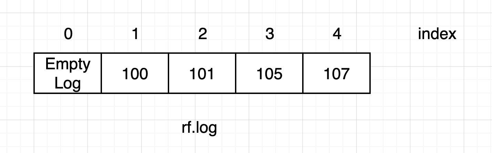
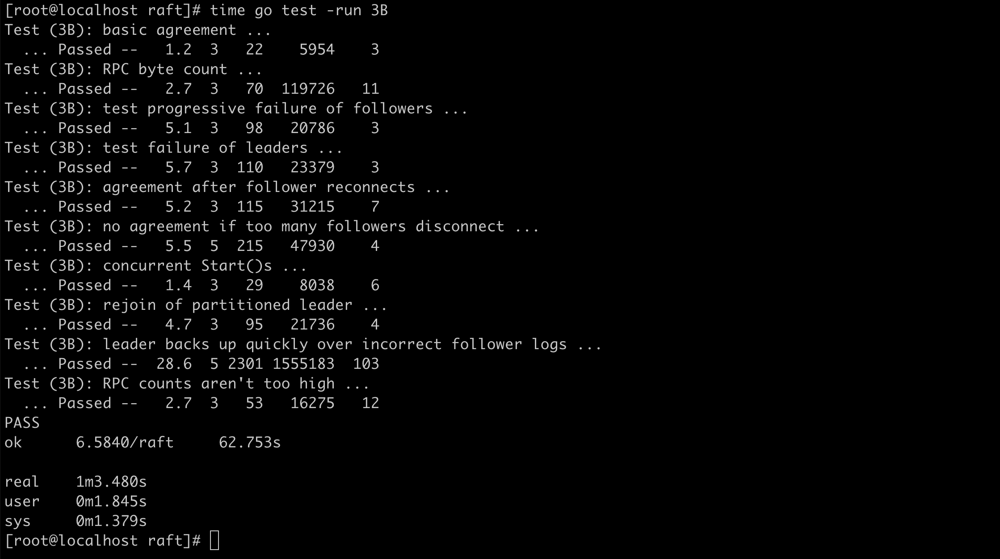
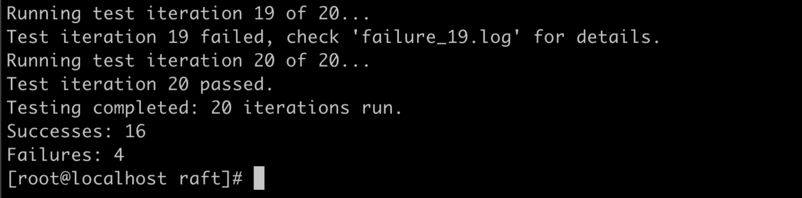
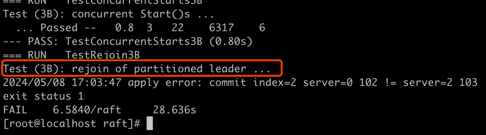
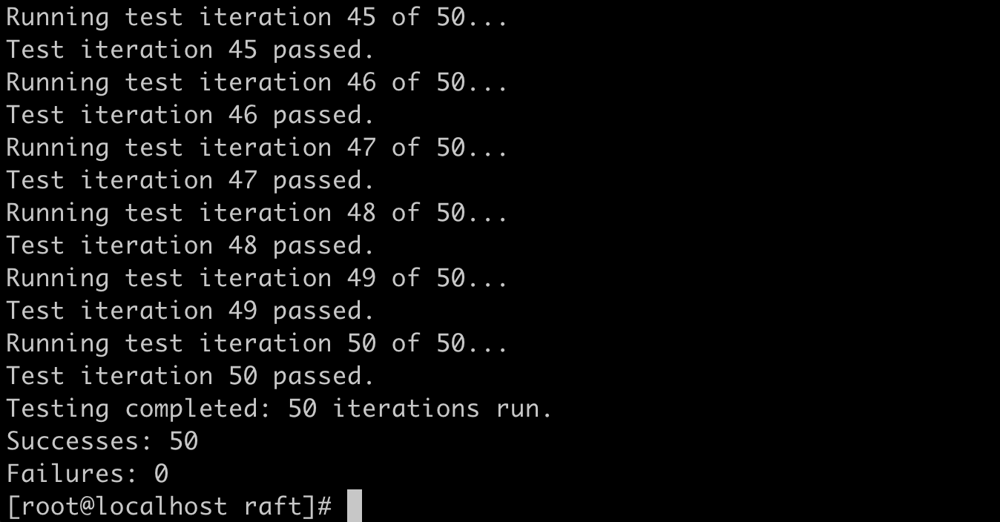
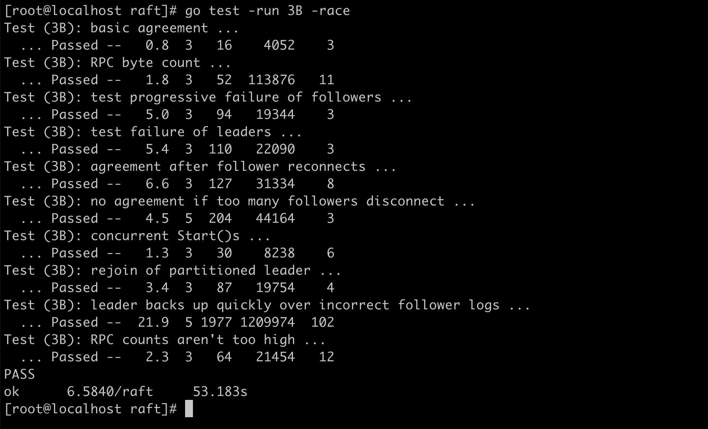

这个实验(`lab3B`)真是把我写吐了，我在工作之余的时候来写这个实验，写了半个月。有时候为了通过后面的测试用例改了代码，前面的用例就无法通过了。  
我读了很多遍论文中的算法描述，也读了多遍的测试代码(即Lab的框架代码)，加了很多日志，最后才能不断地往下走，真是太难了。

# 0. 注意事项
这个实验对于我本人来说是很难的，建议多读几遍论文中日志复制的算法描述部分、`test_test.go`和相关代码，不至于两眼一抹黑。

# 1. 写在前面
修正实验3A中出现的错误
## 1.1 选举限制
在进行实验3B的过程中，我发现在实验3A中的获取选票函数，即`func (rf *Raft) RequestVote(args *RequestVoteArgs, reply *RequestVoteReply)`未能遵循`5.4.1 选举限制`的内容。后来我做了更新。  
如果对方的log不比自己旧，我才给它投票。  

## 1.2 Raft协议描述
这幅图是重中之重，需要仔细研读


# 2. 要点难点解析
## 2.1 committed(已提交)和applied(已应用)
这两个概念起初我并没有认真对待，导致部分测试用例没法通过，其实仔细阅读论文的描述即可弄清楚。  
这里重新描述一下: 当`Leader`把日志通过`AppendEntries`复制到半数以上的节点(包括`Leader`自身)后，`Leader`认为自己`committed`(即已提交)，并且通知其他`Follower`节点，信息是`Leader`的`commitIndex`，供其他`Follower`节点按需更新自己的`commitIndex`。  
节点(例如`Leader`、`Follower`等)把已提交的日志应用到状态机，即把`ApplyMsg`写入`applyCh`，认为applied(即已应用)。  

对于`Follower`:
(这是最常见的情况)接收到`Leader`的`committed`的通知后，把对应日志认为是`committed`，并更新自身的`commitIndex`，供apply线程(`applyLog`函数)去应用。
`Leader`发送心跳给`Follower`时,可能会附带日志的`committed`，`Follower`可以根据这个信息来更新日志状态为`committed`。  

## 2.2 节点何时新增日志与如何新增日志以及Leader如何确定半数日志已经保存
* 注意: `Leader`和`Follower`之间的通信是`AppendEntries`，包括`Leader`新增日志后向`Follower`更新、心跳包、包含日志的日志修复请求(走心跳包，不过添加了日志信息)
* 何时新增: `Leader`只会接受client发送来的日志并进行新增操作。`Follower`在两种情况下新增日志，一是`Leader`接收到新增日志后，发送给`Follower`新增日志消息。第二种是心跳包，`Leader`发现心跳包给`Follower`，发现`Follower`日志和`Leader`不一致的地方很多，需要添加日志发送给`Follower`进行日志修复。
* 如何新增: Leader直接append到自己的rf.log数组。Follower在通过日志一致性检查之后，append到自己的rf.log数组。
* `Leader`如何确定半数日志已经保存: `Leader`通过`rf.matchIndex`数组，查看对于某个index，是否有半数以上节点进行了确认。`Leader`收到`AppendEntries`的回复消息，即`AppendEntriesReply`，如果即`AppendEntriesReply.Success`为true，表示日志添加成功，此时`Leader`需要更新对应的`rf.nextIndex[]`和`rf.matchIndex[]`。

## 2.3 何时提交与如何提交以及对应数据结构如何更新
* 何时提交: 对于某个index对应的日志，如果收到半数的确认，即认为可以进行提交。更新本地`rf.commitIndex`表示后面需要对`rf.commitIndex`对应的日志进行提交，在`rf.commitIndex`之前的日志也被认为将要进行提交。
* 如何提交: `Leader`根据半数的确认，更新本地`rf.commitIndex`进行提交。`Follower`根据`Leader`发来的`commitIndex`更新本地的`rf.commitIndex`。注意前提是通过日志一致性检查。
* 对应数据结构如何更新: `Leader`需要更新自己的`rf.commitIndex`，`Follower`根据`Leader`的`rf.commitIndex`与自己的日志情况更新自身的`rf.commitIndex`。

## 2.4 何时应用与如何应用以及对应数据结构如何更新
* 何时应用: 如果`Leader`和`Follower`发现自身的`rf.commitIndex < rf.lastApplied`，即可进行应用。应用就是把日志写到`rf.applyCh`，随后更新`rf.lastApplied`。
* 如何应用: `rf.applyCh <- *msg`随后`rf.lastApplied++`
* 对应数据结构如何更新: `rf.lastApplied++`

## 2.5 Leader与Follower在提交和应用上的区别
先说规则，`Follower`跟着`Leader`来，`Leader`先提交，然后通知`Follower`提交。应用的话，没有严格的先后顺序，看系统的调度了。  

## 2.6 一些优化情况
* 通过心跳包发送日志，加快问题日志恢复，避免问题日志一直等待新增日志的请求来修复
* 立即重发心跳包，不用等待心跳间隔
* 优化获取最大满足半数的index的逻辑，快速找到可以提交的index。使用函数`findMaxGreaterThanHalf`，具体做法是复制一份`rf.matchIndex[]`，然后进行排序，找到第一个大于等于中间下标对应值的那个值，用作可以提交的index。避免每次`+1`，也避免日志恢复的时候，多个`Follower`可能日志不同带来的复杂逻辑。

## 2.7 Raft结构体里各参数介绍
为了加快对Raft协议的理解，这里简单介绍Raft结构体里的部分重要参数
* **commitIndex**: 记录当前节点提交的index，意思是index之前(包含本条日志)的日志都被认为已经提交。
* **lastApplied**: 记录当前节点已经应用的index，从`lastApplied`到`commitIndex`之间的日志可以进行提交。
* **nextIndex  []int**: 记录可以可以发往每个节点的下一条日志的index，在`Follower`日志和`Leader`不一致时，`Leader`的这个值会慢慢变小，直到找到`Follower`和`Leader`一致的地方，然后发送在此之后的日志。
* **matchIndex []int**: 记录每个节点的最新的一致的index，可以根据这个值来判断某个index是否满足半数。

# 3. 实验代码编写与函数功能介绍
为了能够尽快的找到编写实验的切入点，我会对几个重要函数的功能进行介绍
## 3.1 AppendEntries函数
函数原型是`func (rf *Raft) AppendEntries(args *AppendEntriesArgs, reply *AppendEntriesReply)`  
该函数首先进行日志的一致性检查，只有在通过一致性检查之后，方能添加`AppendEntriesArgs`携带的日志。  
通过日志一致性检查后，`reply.Success`返回`true`，否则返回`false`。

## 3.2 RequestVote函数
需要增加**选举限制**的判断（参见1.1节）。

## 3.3 Start函数
Start函数根据入参构造`LogEntry`，添加到自己的`log`数组里，并发送`AppendEntry`给`Follower`，进行一次agreement。

## 3.4 (新增)sendAppendEntries函数
这个函数是我自己新增的，它被`Leader`调用，作用是把`Leader`的日志发送给各个`Follower`，并且在收到半数的成功回复后，将这条日志置为`committed`。  
注意这里发向每个`Follower`的日志不一定一样，因为有的`Follower`落后`Leader`太多，要发送它们之间不一致的日志。具体细节留到后面讨论。

## 3.5 (新增)sendAppendEntry函数
这个函数是我自己新增的，用于`Leader`发送给单个`Follower`，`sendAppendEntries`函数循环调用`sendAppendEntry`函数，里面的细节也很多。

## 3.6 (新增)applyLog函数
这个函数是我自己新增的，作用是循环检测是否有`committed`的日志。对于这些日志，需要进行应用(apply)。

## 3.7 (新增)sendHeartbeats函数
这个函数是我自己新增的，作用是循环调用`sendHeartbeat`函数，维持`Leader`的权威，也用于快速日志恢复。

## 3.8 (新增)sendHeartbeat函数
这个函数是我自己新增的，作用是维持`Leader`的权威，也用于快速日志恢复。  

## 3.9 (新增)commitLog函数
这个函数是我自己新增的，考虑到`Leader`发给每个`Follower`的日志可能不一样，所以如何判断某一条日志是否达到半数的确认就比较困难，`commitLog`函数玄循环监控`Leader`的`rf.matchIndex`数组，判断对于某个index的日志是否达到半数确认，如果满足，`commitIndex`就进行更新.

# 4. 开发过程中遇到的问题(部分)
以下是一些我在开发过程中遇到的问题，有些错误比较低级，但是或许有参考价值。
## 4.1 日志索引从0还是1开始？
为了使日志的下标和日志索引(`log index`)保持一致，并且从1开始（测试程序从1读取log），我在`Raft`节点初始化时，添加了一个空的`logEntry`到log里。以下以Leader的rf.log为例。  


## 4.2 心跳的发送需要异步
我犯了一个低级错误，就是在依次发送心跳的时候，错误的使用了同步发送的模式。这导致如果其中一个`Follower`断开连接了，那么如果有后面一个`Follower`，那么后面这个`Follower`就无法收到心跳包了。我改成了异步发送心跳包解决了这个问题。

## 4.3 正确更新commitIndex和lastApplied
`Raft`节点的`commitIndex`表示本节点已经提交的日志的下标，`lastApplied`下标到`commitIndex`下标之间的内容，可以被应用(apply)。
`Leader`节点附加日志(`AppendEntry`)在收到半数确认后，即可更新`commitIndex`。
`commitIndex`和`lastApplied`的介绍可以参考2.7节。

## 4.4 如何判定一个日志被保存到多个机器上
使用`matchIndex[]`来判断，`matchIndex[]`记录着所有节点当前日志复制的情况，记录当前节点最新的那条日志的index，因此可以根据这个数值来判断出最大的满足半数的index。

# 5. 日志一致性检查
日志一致性检查的逻辑在函数`func (rf *Raft) AppendEntries(args *AppendEntriesArgs, reply *AppendEntriesReply)`里。  
一致性检查通过后，`reply.Success=true`，否则为`false`。  
一致性检查的基本原理是，请求体里给出需要添加的日志，以及`Leader`里，这些新加日志的前一条日志的信息，包括`PrevLogIndex`和`PrevLogTerm`。  
现在要做的是，先比较前一条日志和当前`Follower`的最新日志是不是一样，不一样的话，新日志就不能添加了。我们的目的是要找到匹配的那一条日志，双方要找到最新的一致的一条日志，然后在此之后才能添加日志。  
我们可以想到，这个过程需要多次的协商，`Leader`发过来的日志也可能不断变化(加上协商不一致的日志)。总之，最后`Leader`和`Follower`找到两者最近的一致的地方，然后`Leader`把这之后的日志一并打包发过来给`Follower`更新。  
这个过程中，如果一致性检查失败，`Leader的rf.nextIndex[]`会不断`-1`，用以标记下一次需要发送的日志的开始index。  
当然，日志一致性通过后，日志更新也OK了，`Leader`就要更新对应的`rf.nextIndex[]`和`rf.matchIndex[]`了，用于后续提交和应用之类的操作。
  
# 6. (部分)test_test.go文件中函数和测试用例介绍
## 6.1 func (cfg *config) one(cmd interface{}, expectedServers int, retry bool) int函数

## 6.2 TestBasicAgree3B
用于测试验证3轮agreement是否都能达成。注意这里需要3轮agreement都要正确apply，否则无法通过测试。  
主要考察日志是否能正确添加append、提交commit、应用apply。

## 6.3 TestRPCBytes3B
测试RPC传输的数据量是否超标?

## 6.4 TestFollowerFailure3B
测试少数`Follower`断开后，集群是否能够正常提交与应用日志。  
测试多数`Follower`断开时，集群是否不能提交日志。

## 6.5 TestLeaderFailure3B
测试3个节点的集群中，1个`Leader`失联后，剩下的两个`Follower`能否正确选择`Leader`。
测试2个节点的集群中，1个`Leader`失联后，仅剩的一个节点是否不能提交（1个`Leader`节点无法提交，因为剩下的两个节点挂了，它永远达不到半数的确认）。

## 6.6 TestFailAgree3B
测试3个节点的集群中，一个`Follower`断开一段时间后重新连接，能否与`Leader`重新保持日志的一致。

# 7. 测试通过

## 7.1 一些待改进的地方
* 暂时未加上-race进行测试
* 连续多次测试(20次)的时候，会有5次报错  

错误的信息是  
```text
apply error: commit index=2 server=0 102 != server=2 103
```


## 7.2 测试脚本
脚本名: `manyTest_3B.sh`    
```shell script
#!/bin/bash

# 初始化计数器
count=0
success_count=0
fail_count=0

# 设置测试次数
max_tests=50

for ((i=1; i<=max_tests; i++))
do
    echo "Running test iteration $i of $max_tests..."

    # 运行 go 测试命令
    go test -v -run 3B &> output.log

    # 检查 go 命令的退出状态
    if [ "$?" -eq 0 ]; then
        # 测试成功
        success_count=$((success_count+1))
        echo "Test iteration $i passed."
        # 如果想保存通过的测试日志，取消下面行的注释
        # mv output.log "success_$i.log"
    else
        # 测试失败
        fail_count=$((fail_count+1))
        echo "Test iteration $i failed, check 'failure_$i.log' for details."
        mv output.log "failure_$i.log"
    fi
done

# 报告测试结果
echo "Testing completed: $max_tests iterations run."
echo "Successes: $success_count"
echo "Failures: $fail_count"
```

执行命令  
```shell script
./manyTest_3B.sh
```
50次测试都正常通过  


## 7.3 加上-race进行测试
测试结果如下  


(未完待续 to be continued)
